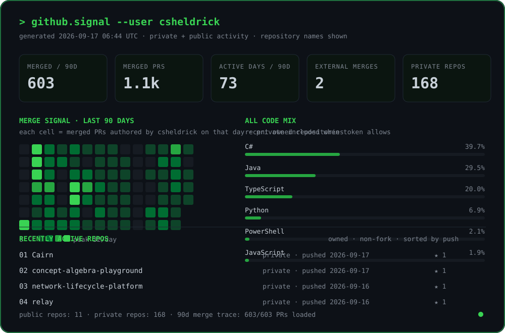

<strong>software systems · developer tooling · AI experiments · learning by building</strong>

  

---

The signal panel is generated from GitHub API data by this repository's own scheduled workflow. No third-party stats renderer.
